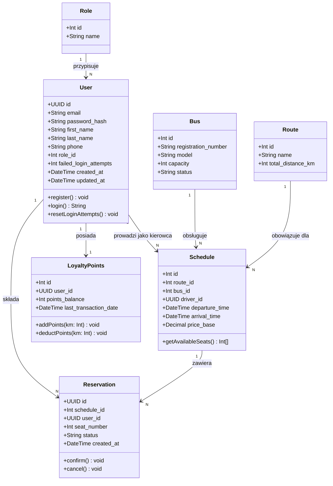
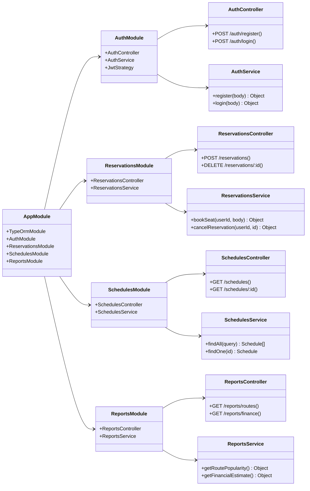

# Diagram Klas – System KKBus

**Zadanie:** 1.2 | **Czas realizacji:** 4 dni | **Autor:** Nikita Parkovskyi

---

## Diagram klas encji (model domenowy)

---

## Diagram modułów backendu (NestJS)

