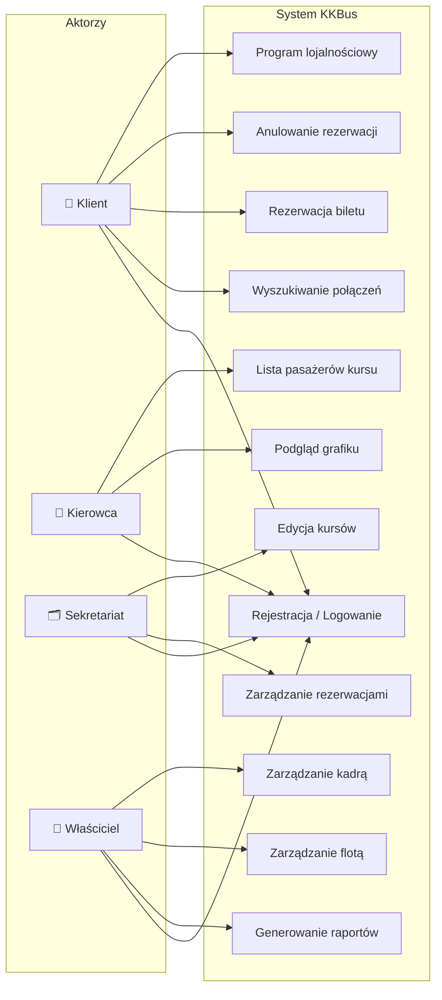
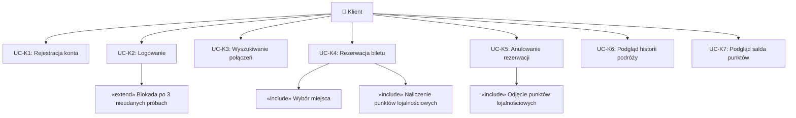
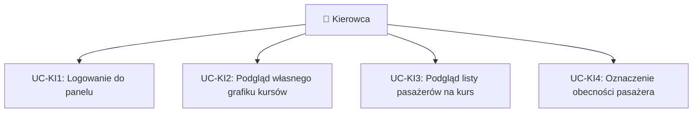
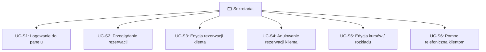
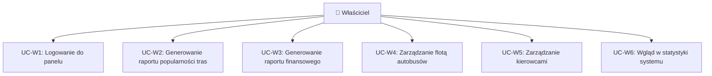

# Diagramy Przypadków Użycia – System KKBus

**Zadanie:** 1.2 | **Czas realizacji:** 3 dni | **Autor:** Nikita Parkovskyi

---

## 1. Widok globalny systemu

---

## 2. Szczegółowy diagram – Klient

---

## 3. Szczegółowy diagram – Kierowca

---

## 4. Szczegółowy diagram – Sekretariat

---

## 5. Szczegółowy diagram – Właściciel

---

## 6. Tabela przypadków użycia

| ID | Nazwa | Aktor | Priorytet |
|---|---|---|---|
| UC-K1 | Rejestracja konta | Klient | Wysoki |
| UC-K2 | Logowanie | Klient, Kierowca, Sekretariat, Właściciel | Wysoki |
| UC-K3 | Wyszukiwanie połączeń | Klient | Wysoki |
| UC-K4 | Rezerwacja biletu | Klient | Wysoki |
| UC-K5 | Anulowanie rezerwacji | Klient | Wysoki |
| UC-K6 | Podgląd historii podróży | Klient | Średni |
| UC-K7 | Podgląd salda punktów | Klient | Średni |
| UC-KI2 | Podgląd grafiku | Kierowca | Wysoki |
| UC-KI3 | Lista pasażerów kursu | Kierowca | Wysoki |
| UC-S3 | Edycja rezerwacji | Sekretariat | Wysoki |
| UC-S5 | Edycja kursów | Sekretariat | Wysoki |
| UC-W2 | Raport popularności tras | Właściciel | Wysoki |
| UC-W3 | Raport finansowy | Właściciel | Wysoki |
| UC-W4 | Zarządzanie flotą | Właściciel | Średni |
